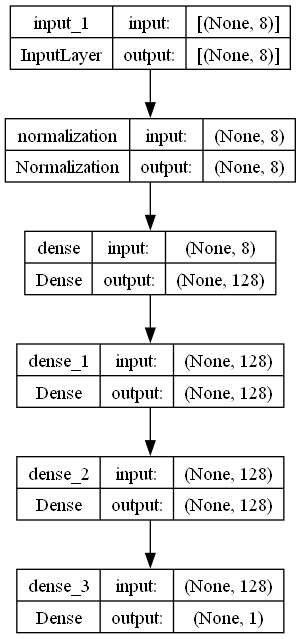

# Second Hand Cars Price Prediction with TensorFlow

Welcome to the Second Hand Cars Price Prediction project! This project utilizes a Regression-based Neural Network in TensorFlow to predict the prices of second-hand cars based on various parameters such as kilometers driven, car age, rating, condition, economy, and more.

## Dataset

The dataset used for this project is sourced from Kaggle, created by Mayank Patel. You can find the dataset [here](https://www.kaggle.com/datasets/mayankpatel14/second-hand-used-cars-data-set-linear-regression).

## Data Visualization

Below is a plot of the dataset showing the relationship between kilometers driven and car price. As observed, kilometers driven and price are inversely related, indicating a significant impact on price prediction.

## Model Architecture

The model consists of three dense layers, each with 128 neurons activated using the ReLU function. This architecture allows the model to capture complex patterns in the data.

## Training Loss

The following plot shows the training loss of the model over epochs. As seen, the loss decreases steadily, indicating that the model is learning effectively.

## Root Mean Squared Loss

The plot below illustrates the Root Mean Squared Loss (RMSE) of the model, demonstrating the model's performance in terms of prediction accuracy.

## Model Predictions

Finally, here is a plot showing the model's predictions on the test set. The model performs well, providing accurate price predictions for second-hand cars.

## Conclusion

This project successfully demonstrates the use of TensorFlow for predicting second-hand car prices with a neural network. The model's performance, as indicated by the decreasing loss and accurate predictions, suggests that it can be a valuable tool for price estimation in the used car market.

Feel free to explore the code and data, and contribute to the project if you have any improvements or suggestions!
